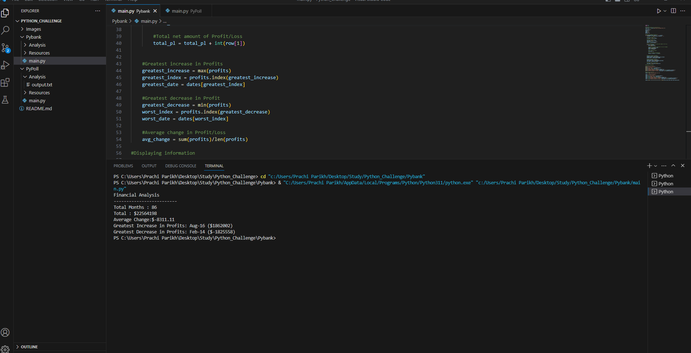
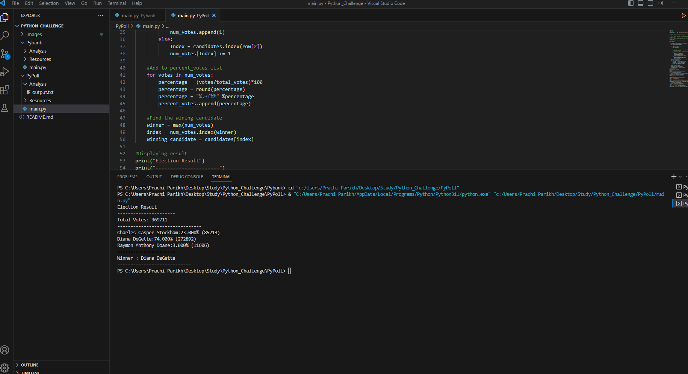

# Python_Challenge #Module_3_Challenge

# PyBank Challenge

## Task

* The total number of months included in the dataset
* The net total amount of "Profit/Losses" over the entire period
* The changes in "Profit/Losses" over the entire period, and then the average of those changes
* The greatest increase in profits (date and amount) over the entire period
* The greatest decrease in profits (date and amount) over the entire period

## My Result of PyBank Task

# PyPoll Challenge

## Task

* The total number of votes cast
* A complete list of candidates who received votes
* The percentage of votes each candidate won
* The total number of votes each candidate won
* The winner of the election based on popular vote

## My Result of PayPoll Task

